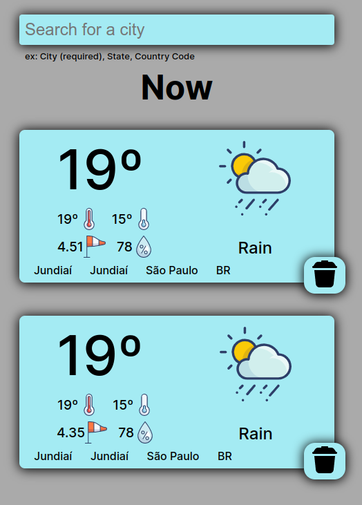

# WeatherApp

This app is an assignment from [TheOdinProject](https://www.theodinproject.com/lessons/node-path-javascript-weather-app), focusing in async functions.

The weather information comes from [OpenWeather API](https://openweathermap.org/current#one).

The icons come from [Pixeden](https://www.pixeden.com/media-icons/the-color-icons-set-weather), and [Icons8](https://icons8.com/icons/set/delete).

The searched cities are stored in the browser LocalStorage.

 
